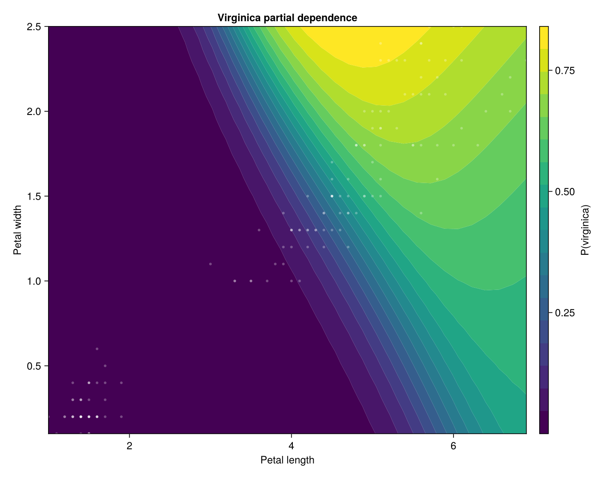
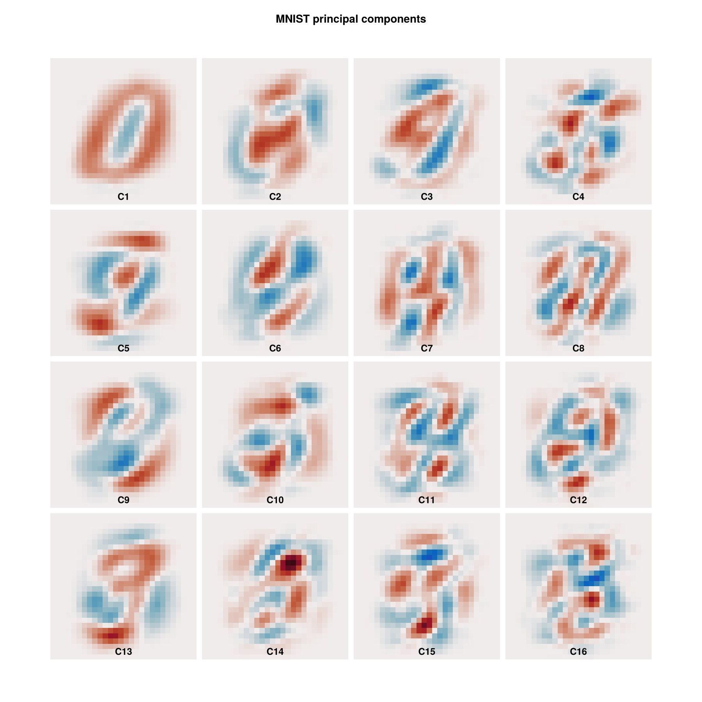
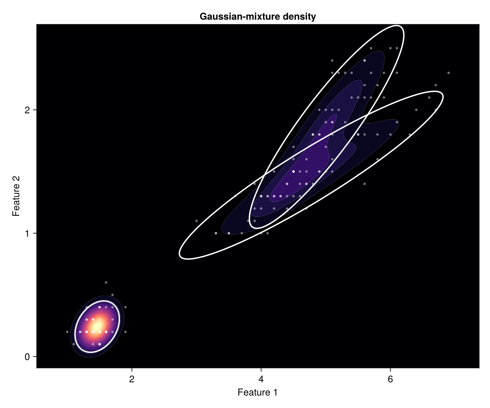
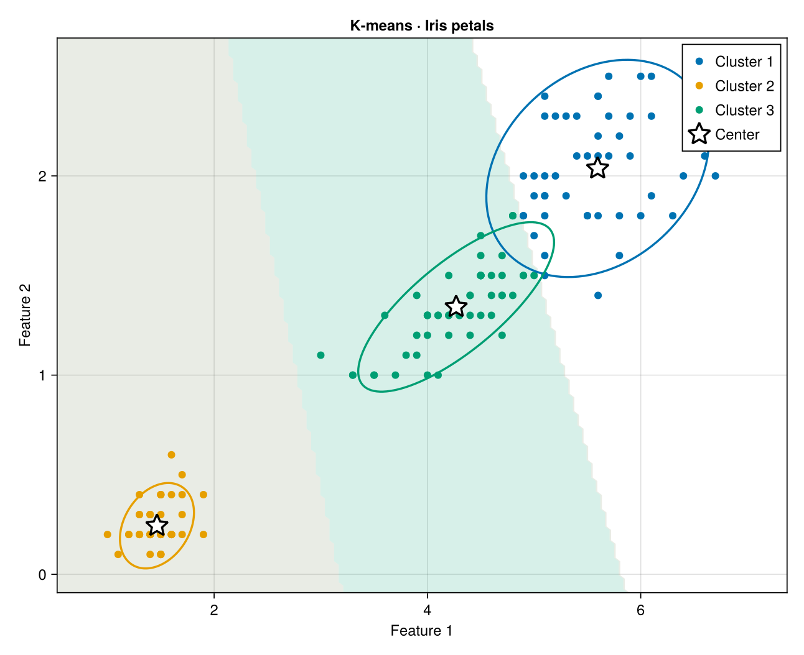
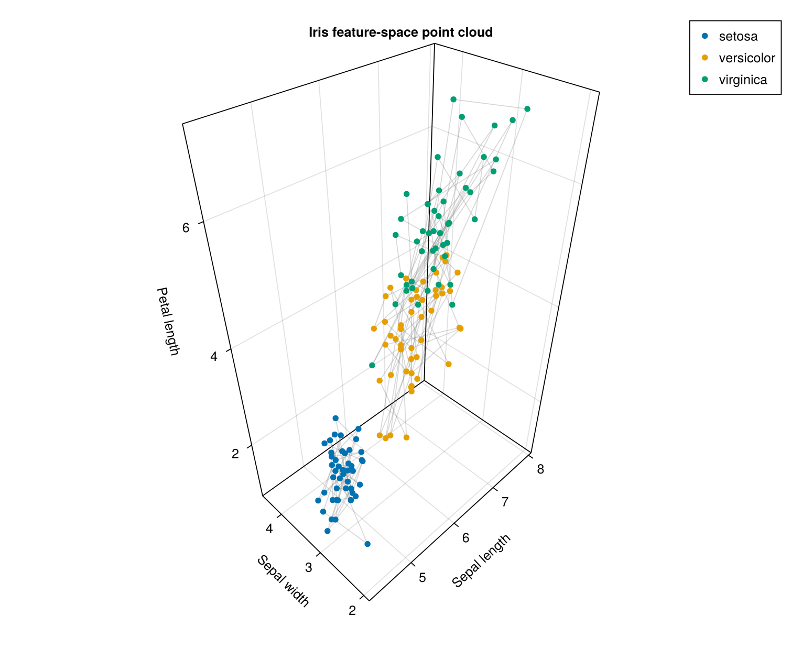

# Tilia.jl

Tilia is a Julia-native classical machine-learning stack with composable
pipelines, explicit data and numerical contracts, structured diagnostics, and
optional acceleration.

[Documentation](https://thimotedupuch.github.io/Tilia.jl/) ·
[Contributing](CONTRIBUTING.md) ·
[License](LICENSE)

> [!IMPORTANT]
> Tilia is experimental. The API and persistence format may evolve before
> 1.0, and model coverage should not yet be interpreted as production maturity.

## Quick start

Estimator specifications are immutable. Calling `fit` returns a separate value
containing learned state, the training schema, and a structured report.

```julia
using Tilia

# Rows are homes; columns are floor area and building age.
X = [
     48.0  35
     62.0  24
     74.0  18
     86.0  12
    101.0  20
    118.0   7
    137.0  10
    156.0   3
]
price = [158.0, 192.0, 225.0, 267.0, 301.0, 356.0, 401.0, 468.0]

Xtrain, Xtest, ytrain, ytest, _, _ =
    train_test_split(X, price; test_size=0.25, seed=42)

model = Chain(
    Standardize(),
    RidgeRegression(lambda=0.2),
)

fitted = fit(model, Xtrain, ytrain)
predictions = predict(fitted, Xtest)

root_mean_squared_error(ytest, predictions)
report(fitted)
```

Observations are rows and features are columns. Preprocessing inside a `Chain`
is fitted only from training rows, preventing train/test leakage.

## Why Tilia?

Tilia treats the surrounding ML system as part of the model rather than as
unrelated utilities:

- **One estimator lifecycle.** Models, transformers, clustering, decomposition,
  and meta-estimators consistently use `fit`, `predict`, `predict_proba`, or
  `transform`.
- **Semantic pipelines.** `Chain`, `ColumnMap`, `Select`, `Parallel`, and
  `Concatenate` form inspectable computation graphs.
- **Explicit contracts.** Schemas retain feature meaning and ordering;
  `capabilities(model)` declares support for sparse data, missing values,
  weights, probabilities, and incremental fitting.
- **Reproducible execution.** `FitContext` carries deterministic random streams,
  numerical policy, backend selection, and compilation caches.
- **Inspectable results.** Every fit produces a `FitReport` containing the
  relevant convergence, timing, backend, and execution details.
- **Structural persistence.** Fitted models and graphs can be saved and loaded
  without relying on opaque Julia object serialization.

## What is included?

| Area | Highlights |
|:--|:--|
| Data and preprocessing | Tables.jl inputs, schemas, imputation, encoding, scaling, normalization, polynomial features |
| Supervised learning | Linear, sparse, generalized-linear, robust, ordinal, neighbor, kernel, tree, ensemble, and shallow-neural models |
| Unsupervised learning | PCA, truncated SVD, NMF, FastICA, random projection, clustering, mixtures, and anomaly detection |
| Meta-estimators | Multiclass reductions, multi-output models, classifier chains, bagging, voting, stacking, calibration, and threshold selection |
| Evaluation | Metrics, deterministic splitting, cross-validation, tuning, calibration curves, and permutation importance |
| Operations | Numerical policies, semantic graphs, reports, tracing, optimization, persistence, and optional acceleration |

## Visualization

Plotting lives in the separate `TiliaMakieRecipes` package, keeping Makie out
of the core dependency graph. These figures are generated from fitted Tilia
models and semantic diagnostic results:

<p align="center">
  
  
</p>

<p align="center">
  
  
</p>

<p align="center">
  
</p>

More standalone examples are available in the
[`TiliaMakieRecipes` demonstrator](TiliaMakieRecipes/demonstrator).

The [model guide](https://thimotedupuch.github.io/Tilia.jl/stable/models.html)
and `model_catalog()` provide the complete model inventory. Use
`capabilities(model)` when writing generic workflows instead of assuming that
all estimators accept the same data or operations.

## Installation

Until Tilia is registered, install it directly from GitHub:

```julia
using Pkg
Pkg.add(url="https://github.com/thimotedupuch/Tilia.jl")
```

After registration, installation will simply be:

```julia
using Pkg
Pkg.add("Tilia")
```

Tilia supports Julia 1.10 and later. The core package keeps a small dependency
surface and does not require Python.

## Optional integrations

- **Visualization:** [`TiliaMakieRecipes`](TiliaMakieRecipes) supplies Makie
  recipes for semantic metrics, fitted models, diagnostics, dimensionality
  reduction, clustering, and explanatory plots.
- **Acceleration:** loading Reactant activates supported compiled preprocessing,
  projection, and linear/logistic inference paths through `ReactantBackend`.
- **Differentiation:** loading DifferentiationInterface enables automatic
  differentiation for custom scalar objectives.

These integrations are weak dependencies and do not enlarge the core install
unless explicitly requested.

## Documentation and development

The [manual](https://thimotedupuch.github.io/Tilia.jl/) covers complete
workflows, data schemas, pipelines, model semantics, metrics, persistence,
acceleration, differentiation, and extension interfaces.

Run the core test suite with:

```sh
julia --project=. -e 'using Pkg; Pkg.test()'
```

The repository also contains universal estimator-conformance tests, allocation
budgets, persistence round trips, and committed numerical fixtures generated
with scikit-learn. See [CONTRIBUTING.md](CONTRIBUTING.md) for the optional test
environments and benchmark commands.

## License

Tilia is available under the [MIT License](LICENSE).
